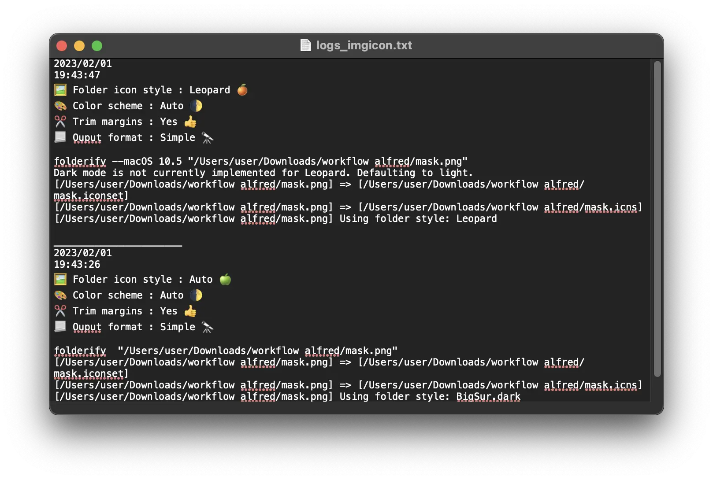
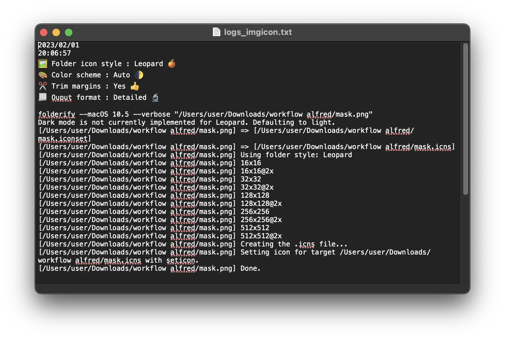

[](https://github.com/BenjaminOddou)
[](https://saythanks.io/to/BenjaminOddou)

Welcome to the Alfred Folderify repository: **An Alfred Workflowk** ✨

## ✅ Prerequisite

* 🍎 MacOS
* 🎩 Alfred 5. Note that the [Alfred Powerpack](https://www.alfredapp.com/powerpack/) is required to use workflows.

## ℹ️ information

* 🏎️ Under the hood, the icon generation is made with [folderify](https://github.com/lgarron/folderify) made by [Lucas Garron](https://github.com/lgarron).

## ⬇️ Installation

1. [Download the workflow](https://github.com/BenjaminOddou/alfred-folderify/releases/latest)
2. Double click the `.alfredworkflow` file to install


## 🧙‍♂️ Invoke the Workflow

There is 2 flows in this workflow :

1. The first one allows you to assign an generated icon to one or multiple folder(s). It can be triggered by writing `foldicon` keyword.
2. The second allows you to generate `mask.icns` and `mask.iconset` files from one or multiple mask(s). You can invoke this flow with the `imgicon` keyword.

You can change these values by changing the `🕹️ Trigger 1` or `🕹️ Trigger 2` variables in workflow configuration panel [optionnal]. Please avoid putting the same trigger for the two flows.

## 🧰 Setup the workflow

### 👨‍💻 Install dependencies

#### Open the Terminal of you Mac and run the following commands

1. ☑️ Install Homebrew.

```shell
/bin/bash -c "$(curl -fsSL https://raw.githubusercontent.com/Homebrew/install/HEAD/install.sh)"
```

2. ☑️ Install folderify.

```shell
brew install folderify
```

💡 Note that you have [other installation options](https://github.com/lgarron/folderify#other-installation-options) for folderify

### 📂 Data (Logs) folder

❗ This variable cannot be empty. You can change it at your convenience in the workflow configuration panel.

It contains the output logs generated by folderify.

💡 Note that if you change the `Data folder` location after generating logs, you should probably move the files created along in the new folder.

## 🤖 Usage of the workflow

### ⚒️ Setup variables

All of the following variables correspond to a folderify argument. Check the original [folderify documentation](https://github.com/lgarron/folderify#full-options) if you need more details.

1. `🖼️ Folder icon style` correspond to the `--macOS VERSION` folderify argument and allows you to change the style of the icon folder. Here are the current available styles from all macOS versions :

`Auto 🍏` : will detect your system version and apply the correct settings.

`Big Sur 🍌` : --macOS 11.0 and above.


`Yosemite 🍒` : --macOS ["10.10", "10.11", "10.12", "10.13", "10.14", "10.15"].


`Leopard 🍊` : --macOS ["10.5", "10.6", "10.7", "10.8", "10.9"].


2. `🎨 Color scheme` correspond to the `--color-scheme COLOR_SCHEME` folderify argument and allows you to change the color of the icon folder (slight difference). 

`🌓 Auto` : will match current system settings.

`🌑 Dark` : --color-scheme dark will force dark mode.


`🌕 Light` : --color-scheme light will force light mode.


💡 Note that the --color-scheme argument is only avalaible for `Big Sur 🍌` (--macOS 11.0) and above.

3. `✂️ Trim margins` corresponds to the `--no-trim` folderify argument.

`Yes 👍` : transparent margins are trimmed from all 4 sides.


`No 👎` : --no-trim. Keeps transparent margins from the mask.


Here is a small schema to explain the principle :


4. `📃 Ouput format` : corresponds to the `--verbose` folderify argument. 

`Simple 🔭` : simple output.



`Detailed 🔬` : --verbose. Detail output.



### 🔥 Modify icons folders

Launch the first flow with the `🕹️ Trigger 1`, choose the folder you want to modify and press ⏎.


Choose the mask that will be used for generating the new icon and press ⏎.


### 💧 Generate icns and iconset files

Launch the second flow with the `🕹️ Trigger 2`, choose the mask you want to modify and press ⏎.


### 🎩 Alfred Buffer and Universal Actions

For both flows, you can use the `Alfred Buffer` to select multiple folder(s) (flow 1) or maks(s) (flow 2).

`Alfred Buffer` basic commands are :

* ⌥↑ to add a file to the buffer from Alfred's results.
* ⌥↓ to add a file and move to the next item in your list of results.
* ⌥← to remove the last item from the buffer.
* ⌥→ to action all items in the buffer.
* ⌥⌫ to remove all items from the buffer.

To know more on how to use `Alfred Buffer`, follow this [link](https://www.alfredapp.com/help/features/file-search/#file-buffer).

💡 Note that `Alfred Buffer` is preferred compare to the `{query}`, meaning that if you select a folder/image (by clicking on it or by pressing enter ⏎) that is not included in the buffer, **it will not be compressed**.


For both flows you can use the corresponding `Alfred Universal Actions` :

1. If you want to start the first flow, select one or multiple folders and select `Modify folder icon`.


2. If you want to start the second flow, select one or multiple folders and select `Create folder icon from mask`.


### 📃 Logs output

Check the logs of the folderify command under the `Data folder`. The log file contains the 3 parts :
1. Date and time of the workflow launch.
2. Workflow options.
3. Folderify command detailed.
4. Folderify output.

💡 Note that each workflow run is separated by a line.


## ⚖️ License

[MIT License](LICENSE) © Benjamin Oddou
